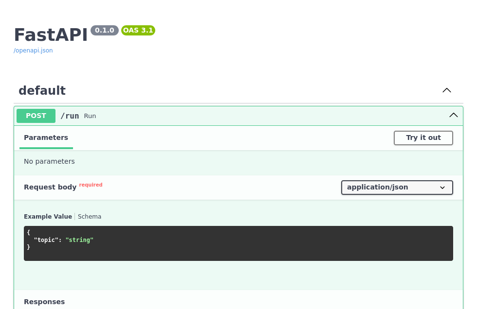

# Otaro

Otaro builds on previous work for programming language models, such as [DSPy](https://dspy.ai/) and [Ell](https://docs.ell.so/).

Highlights:

- **Configs built for sharing and readability**: Define tasks and agents via YAML config or code
- **Automatic learning**: Configs are optimized under the hood without explicit examples
- **Built-in deployment**: Quickly deploy a task via `otaro config.yml` with OpenAPI support
- **Smart parsing**: Parse LLM outputs in a noise-resistant manner with error correction

## Usage

```bash
uv add otaro
```

### Example

Create a YAML config file:

```YAML title="poet.yml"
# A sample config for a haiku writing task

model: gemini/gemini-2.0-flash-001

inputs:
- topic

outputs:
- haiku
```

And a Python script that loads the config.

```Python title="poet.py"
from otaro import Task

task = Task.from_config("poet.yml")
response = task.run(topic="frog")
print(response.haiku)
```

Then either run the python script:

<!-- termynal -->

```console
$ uv run poet.py

Green skin on blue pond,
A croaking song fills the air,
Summer's gentle kiss.
```

Or host the config as an API with interactive OpenAPI docs available at `http://127.0.0.1:8000` for testing.

<!-- termynal -->

```console
$ uv run otaro poet.yml

INFO:     Started server process [2387024]
INFO:     Waiting for application startup.
INFO:     Application startup complete.
INFO:     Uvicorn running on http://127.0.0.1:8000 (Press CTRL+C to quit)
```



## License

This project is licensed under the MIT license.
