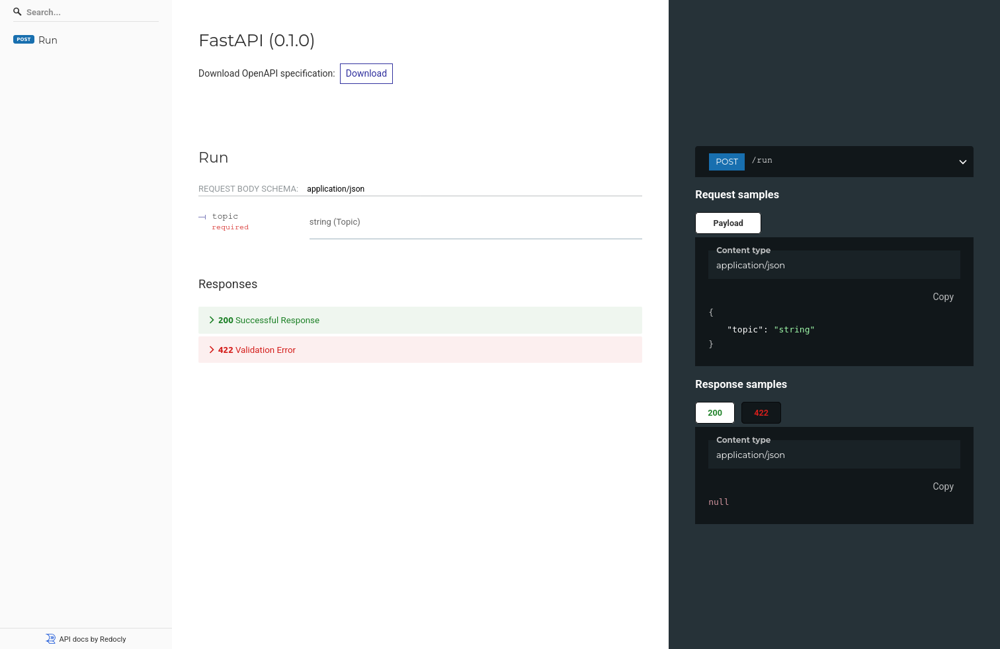

# Deploy config

YAML task configs can be deployed via

```
otaro <config_name>.yml
```

Or

```
uv run otaro <config_name>.yml # if installed via uv
```

<!-- termynal -->

```console
$ uv run otaro poet.yml

INFO:     Started server process [2387024]
INFO:     Waiting for application startup.
INFO:     Application startup complete.
INFO:     Uvicorn running on http://127.0.0.1:8000 (Press CTRL+C to quit)
```

This uses [FastAPI](https://fastapi.tiangolo.com/) under the hood to deploy the config as an API.

## OpenAPI

By default, OpenAPI docs are available at `http://127.0.0.1:8000`.

This is an interactive documentation which can be used to test the config.


## Redoc

An alternative static documentation is also available at `http://127.0.0.1:8000/redoc`


